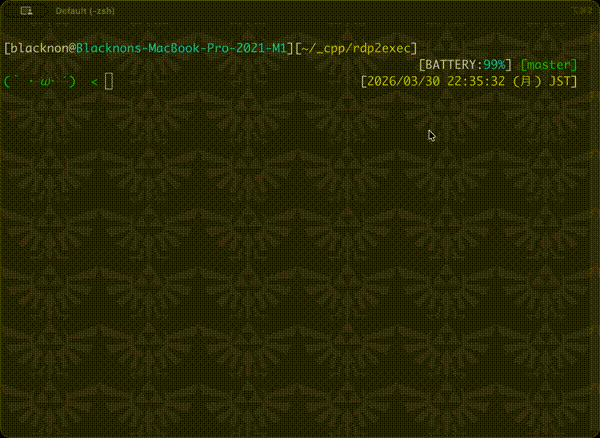

rdp2exec
===

rdp2exec - A CLI tool that enables PowerShell/CMD access and command execution over RDP.



## Description

`rdp2exec` is an experimental remote administration tool that uses RDP as its transport layer and establishes command or shell execution on a Windows host without requiring an additional permanently exposed management port.
It is designed for environments where RDP is the primary reachable entry point and where operators want a programmable way to execute commands or attach to a shell over that connection.

### Features

- Uses RDP as the primary transport channel.
- Supports remote command and shell access over an RDP session.
- Uses drive redirection and a helper process for bootstrap and session setup.
- Supports a ConPTY-based interactive shell path for a more terminal-like experience.
- Designed for Linux-based clients using FreeRDP.
- Aims to avoid requiring an additional permanently open management port on the target host.
- Intended as an experimental and customizable OSS foundation rather than a finished product.


### Note

Note: In some environments, the server-side helper process, temporary files, or execution flow used by rdp2exec may be flagged as suspicious by antivirus or EDR products.
This can occur because the tool uses remote process execution, temporary artifacts, and RDP-based communication patterns that may resemble malware behavior.

rdp2exec is intended for legitimate administrative, testing, and research purposes.


### Structure

. **Launcher (Linux client side)**
   Starts the RDP session, prepares temporary artifacts, handles bootstrap, and bridges the local terminal to the remote session.

2. **FreeRDP client plugin**
   Establishes and manages the Dynamic Virtual Channel (DVC) used for data exchange between the client and the remote helper.

3. **Windows helper / bridge**
   Runs inside the remote Windows session, opens the virtual channel, and connects the channel to a spawned command process or ConPTY-backed shell.


## Usage

### CLI

```bash
# Login shell: PowerShell (default)
rdp2exec user@hostname

# Login shell: CMD
rdp2exec user@hostname cmd

# Command: Run a single PowerShell command without attaching a shell
rdp2exec user@hostname powershell Get-Process

# Command: Run a single CMD command without attaching a shell
rdp2exec user@hostname cmd ipconfig /all

# Non-default port
rdp2exec -p 3390 user@hostname

# Password via argument
rdp2exec -P 'secret' user@hostname powershell
```

`rdp2exec` accepts these positional arguments:

- `user@hostname`
- `powershell` or `cmd`
- optional `command...`

To execute a single command, append `command...` after the shell selector.
If `command...` is omitted, `rdp2exec` starts an interactive shell as before.

### Docker compose

#### Build

```bash
cd ./path/to/this/dir
docker compose build
```

#### Run

```bash
cd ./path/to/this/dir

# shell: PowerShell
docker compose run --rm --service-ports rdp2exec rdp2exec.py user@hostname

# shell: CMD
docker compose run --rm --service-ports rdp2exec rdp2exec.py user@hostname cmd
```
